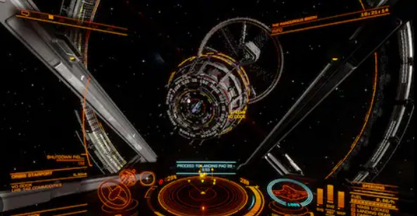
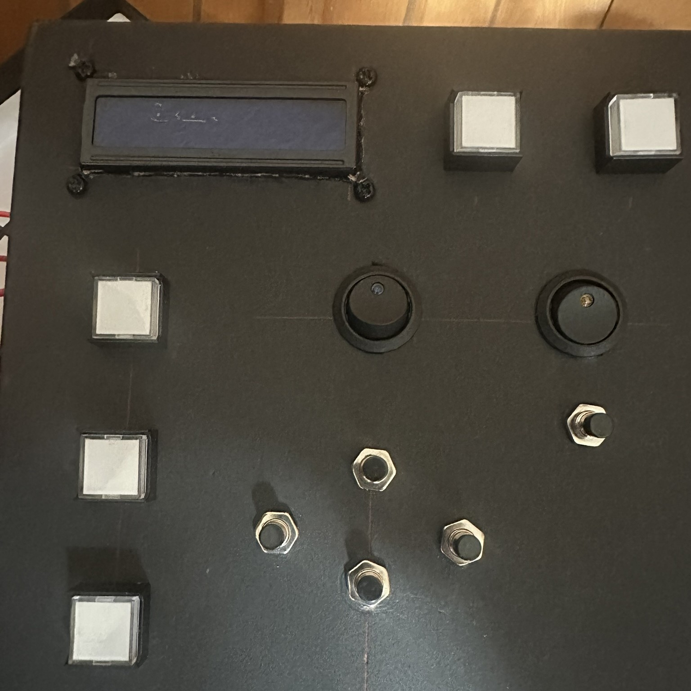

This is the first app that I've gotten to a state where I felt it was completed enough to actually share publicly. I owe that mostly to learning how to define and limit the scope of its functions and not trying to add every idea I had into it at once.

I've long been fascinated with simulator games — especially those focused on flight or mechs. Growing up in the 90s I dreamed of visiting one of the immersive [BattleTech Centers](https://www.mechjock.com/battletech-center-history/) and their full-sized cockpits. Unable to get to one before they all closed down, my fantasies shifted to building one of my own. It was always on the backburner as I slowly acquired the skills needed, and waited for the right game to build it for. What held me up most was finding a game I enjoyed that exposed enough telemetry to make the level of interaction I was after actually possible.

Then not too long ago I discovered [Elite Dangerous](https://www.elitedangerous.com/). A detailed space simulator focused on exploration, commerce, and epic battles. The graphics are absolutely beautiful; the controls intricate but not overwhelming. It even has native VR support for a truly immersive experience. Most importantly, it exposes all telemetry and events via locally saved log files — exactly the kind of data I needed.

The first completed piece of the puzzle is [Elite-Parser](https://github.com/golemedia/Elite-Parser). A small Python application that constantly monitors all relevant files for changes and updates. It provides real-time access to status items like lights, landing gear, and shield levels. It reads the journal file to surface location, supply, and in-game communications data. It also provides functionality to send keystroke input for automated functions.

All data and keyboard commands can be sent and received via either an [MQTT](https://en.wikipedia.org/wiki/MQTT) broker or a direct serial connection. This allows any combination of external modules or programs to be integrated with the system for full customization — including physical buttons, switches, and lights, or an AI co-pilot powered by a local LLM via [Ollama](https://ollama.com/).

It can either be run directly, or a System Tray app can be launched that watches for the game to load, starts the parser automatically, and shuts it down when the game closes. Future enhancements include an integrated MQTT broker, an enhanced GUI for configuration, and native Home Assistant support for expanded immersion control.

Additional modules currently in progress for the overall system include physical controls and feedback hardware, small smoke generators for damage simulation, and — my personal favorite — integration with my [GLaDOS](/posts/glados-introduction/) personal assistant project for real-time voice command and response with full automated control capability.

The project is hosted on [GitHub](https://github.com/golemedia/Elite-Parser). Feedback and ideas are welcome.
