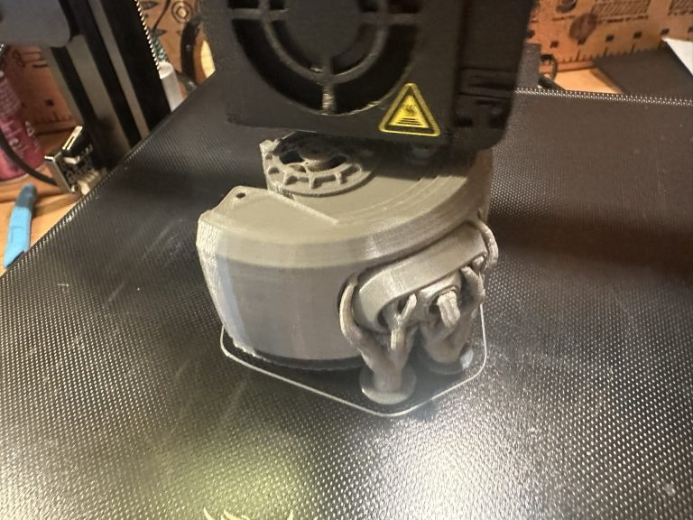
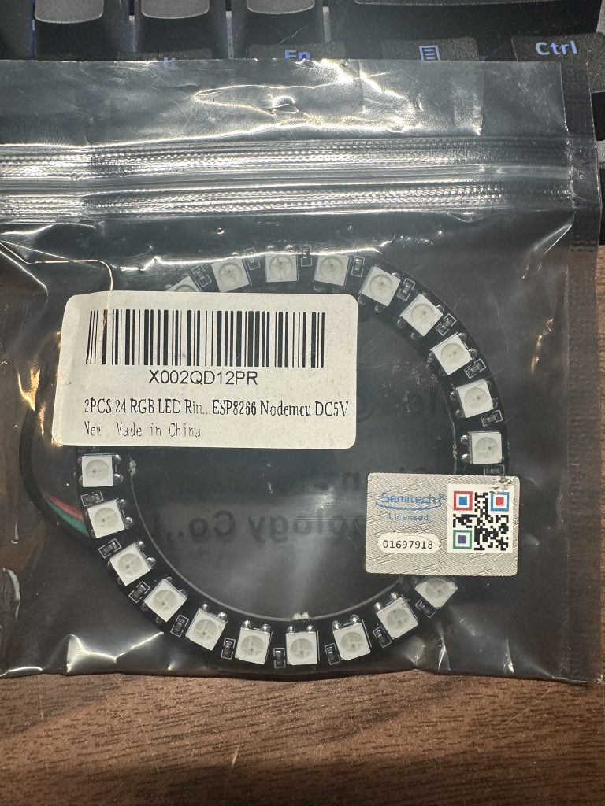

The Google Voice Assistant doesn't have nearly enough functionality for me. Alexa has a huge catalog of skills and routines that do make it useful for a variety of day-to-day interactions. However, she tends to piss me off. I fully understand the limitations of the technology and that a lot of what I want out of it can't yet be done on the platform. I think though it's the fact that she can't match my energy when I get frustrated and she always comes back with the pleasant response and a suggestion of how she could be more helpful that gets to me the most. Always a glutton for punishment I decided I would need to come up with a better solution.

What better AI assistant/sparring partner could there be than always sarcastic, sometimes homicidal, digital entity [GLaDOS](https://theportalwiki.com/wiki/GLaDOS)? An ever present friend(?) that can dish out as much as you can take with all the subtlety of a [Panzer](https://en.wikipedia.org/wiki/Panzer_IV) tank and the delicate grace of an enraged honey badger. Programmed to perform every command and answer any question, but never without an air of confident superiority. Should be fine as long as I don't give her access to anything lethal, right?

The initial idea was spawned some time ago when I discovered a project online documented by [Nerdaxic](https://github.com/nerdaxic/glados-voice-assistant/tree/raspberry). I came across his [YouTube video](https://youtu.be/Y3h5tKWqf-w?si=LhYbWSumcIEQzuXa) while looking for projects for a [Raspberry Pi 4](https://en.wikipedia.org/wiki/Raspberry_Pi_4) I had just acquired. I was amazed by the level of interaction that was available on the platform. From being able to recognize a custom wake-word to allow voice commands to the utilization of an online [TTS generator](https://glados.c-net.org/) that could provide sound files of anything you wanted her to say. The project also included integration of Arduino powered hardware that included an LED/TFT animated screen for the "eye" and integration with Home Assistant for household control.

I got pretty far with that first version of my own GLaDOS, with capabilities including controlling lights, heaters, calling out the room temperature, and announcing the arrival of emails and text messages — all with the razor blade attitude one would come to expect. However, I wanted more. The speech was limited to the online service, which would cue up the text among hundreds of other users doing their random thing. While the local system would cache responses for use later, getting new dynamic audio could take several minutes. Hardly the level of interaction expected of a future AI Overlord. As such, I got bored… repurposed the RPi… and moved on to obsess over other projects.

But I always keep an eye out for a better way…

I upgraded my personal computer which left me with a much better platform for the core functions. My first project with it was running my own lightweight [LLM via Ollama](https://ollama.com/). Impressed with the results, I began the search for an updated Text to Speech solution. Generally it was fairly easy to implement with the various voices provided with each engine, but it took some time to find one that could generate the unique glitchy voice of GLaDOS herself. Finally I came across the [GLaDOS_TTS project from WarriorMama777](https://huggingface.co/WarriorMama777/GLaDOS_TTS). Based on the [Style-Bert-VITS2 Model](https://medium.com/@hideyuda/deploy-style-bert-vits2-speech-synthesis-model-as-a-web-api-0fec9483efee), it provided not only the perfect recreation of her voice, but was able to add just a bit of emotional expression needed to make her commentary have just the right amount of bite.

After tons of research, hours of experimentation, and a little coaching from [ChatGPT](https://openai.com/) I was able to get it up and running like a dream. The lightweight nature of the TTS engine allowed the creation of sound files in near real-time. Coupled with the caching of commonly used phrases the system felt quick and responsive. I built a Python app that allowed for direct input of questions and commands either through a self-hosted web page or by utilizing a structured MQTT packet — flexible enough to integrate with all sorts of programs and modules.

Going back to the Raspberry Pi I added a microphone and the ability to talk to her directly. I created a proof-of-concept avatar in Unity that could indicate speech and mood through an animated "eye". Controls are also in place to allow the eye to follow the speaker around using a webcam also attached to the RPi, though the image processing components are still in progress.

While the TTS is flawless, integration with the LLM has stalled due to the processing hit the system takes while running even the smaller models. Though not as slow as the original online TTS, it still interrupts the flow of the conversation. But it is still being worked on and is definitely being added when possible.

Other future plans and enhancements include integration into my Elite Dangerous Sim-Pit project to allow her to act as a fully capable co-pilot, with in-game Push to Talk functionality for quicker and more immersive interactions. I also plan to eventually build a way to interact with her from a mobile device to control and request status of devices at the house. The ultimate goal… getting my 3D printer up and running and building a fully functional physical form. I found a few projects online to provide a starting point, but that will involve pushing my novice design skills to the limit.

I'll keep you posted…
