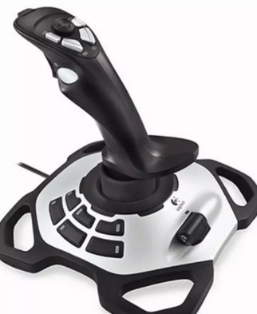
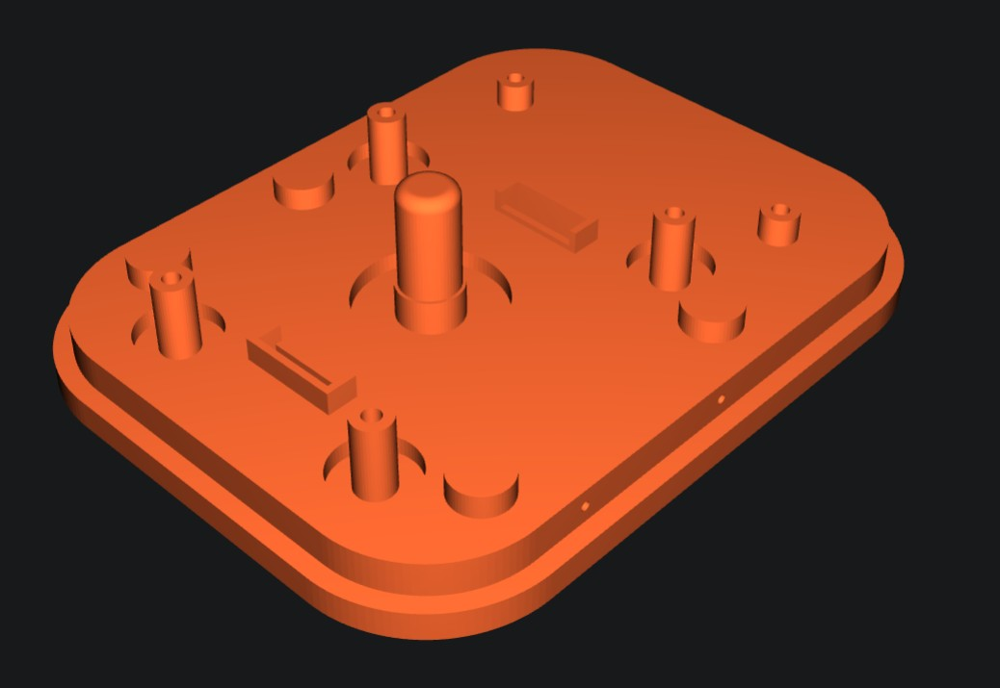
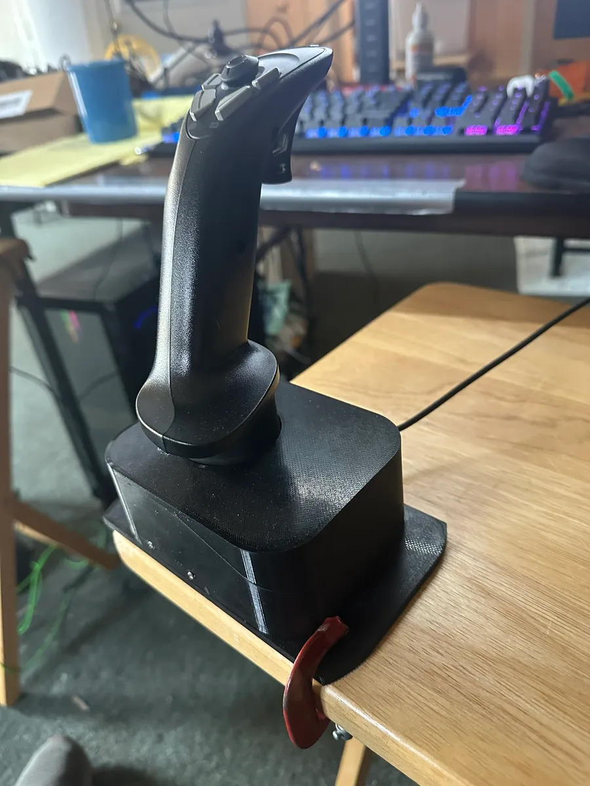

Finished stage one of modding my flight-stick. Utilizing a Thrustmaster Extreme 3D Pro as the base I recreated the housing to make it more compact. Since I plan on separate control boxes, I didn't worry about transferring the six buttons and throttle from the original base. The new housing is printed with PETG and uses an M3 screw for reinforcement of the main shaft. It screws to a mounting base which is currently just a flat piece that I can tape or clamp down while building the rest.

So far it's steady and secure, and at this point I don't anticipate needing to make any structural modifications. I am however considering adding some LEDs and possibly some sort of vibration feedback mechanism. For now I'm going to turn my attention to modding the TWCS Throttle housing.

